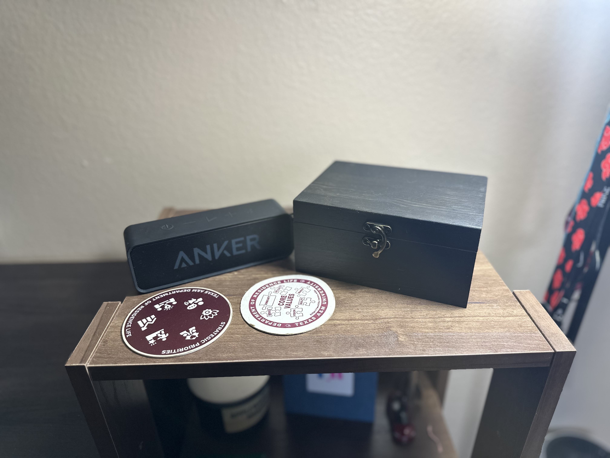

# 🎵 Vinyl Box — NFC Powered Record Player

## 🚀 Project Goal

A Raspberry Pi–based electronic record player that uses NFC tags to control Spotify playback

- Place a record → start music  
- Remove a record → pause  
- Place the same record again → resume  
- Place a different record → switch albums  

Audio plays through a connected speaker, while playback is controlled via Spotify Connect



This is how my finished product came out! I stained a wooden box that I bought off Amazon. I drilled two holes on the side for the aux and power cable. The Raspberry Pi and NFC reader are housed inside the box using velcro strips.

---

## ⚡️ Concepts Explored

1. **I2C Communication**
   - Using the PN532 NFC module over I2C
2. **NFC & UID Mapping**
   - Mapping NFC tags (13.56 Hz) UIDs to Spotify album or playlist URIs
3. **Embedded Linux**
   - Configuring audio, I2C, and services on Raspberry Pi OS
4. **Spotify Web API**
   - Programmatic playback control using OAuth
5. **Headless Audio Streaming**
   - Streaming audio via Librespot and ALSA without a display
6. **Event-Based Control**
   - Reacting to physical interactions (place/remove "record")

---

## 🛠️ Core Materials

- **Raspberry Pi**
- **PN532 NFC Module**
- **NTAG213 NFC Tags**
- **Powered Speaker (with 3.5mm audio jack port)**
- **Jumper Wires**
- **MicroSD Card**

---

## 🔌 Wiring

### Raspberry Pi (I2C) → PN532 NFC Module

| Raspberry Pi Pin | PN532 Pin 
|----------|------------------|
| 3.3V (Pin 1)      | VCC     | 
| GND (Pin 6)      | GND      | 
| GPIO 2 (Pin 3)      | SDA   | 
| GPIO 3 (Pin 5)      | SCL   | 

**Important Notes:**
- The PN532 **must be configured for I2C mode** using its onboard switches
- I2C must be enabled on the Raspberry Pi:

  ```bash
  sudo raspi-config
  # Interface Options → I2C → Enable

- To verify the NFC module is detected by the Pi, my PN532 shows at 0x24:

  ```bash
  sudo i2cdetect -y 1
---

## 📋 How It Works

1. PN532 detects an NFC tag
2. Python reads the tag UID
3. UID is read from a mapped UID to Spotify URI JSON
4. Spotify playback is started or resumed
5. Librespot streams audio to the speaker

---

## ❎ Challenges & Solutions

### 1. Spotify Playback Fails / Tracks Instantly Skip
**Problem:**  
Spotify tracks would immediately skip with errors.

This occurred during both manual playback and NFC-based playback

**Cause:**  
- Incompatible or outdated `Librespot` behavior
- Spotify access point resolution issues
- Network restrictions interfering with encrypted audio streams

**Solution:**  
- Installed a fresh build of **Librespot**
- Explicitly configured access point behavior

---

### 2. No Audio Output Despite Successful Playback
**Problem:**  
Spotify showed “Playing on Vinyl Box,” but no sound was heard from the speaker

**Cause:**  
- Librespot was outputting audio to an incorrect ALSA device
- Default ALSA routing differed from system audio routing (I tested audio from YouTube vs Vinyl Box)

**Solution:**  
- Switched Librespot to the ALSA backend
- Used ALSA-friendly device naming (`hw:0,0`)
- Verified audio output with:

  ```bash
  speaker-test -D hw:0,0 -c 2

---
  
### 3. Devices on Different Subnets
**Problem:**  
Spotify Connect control would fail or behave inconsistently when using hotspots or school (TAMU) WiFi

**Cause:**  
- Controller device (phone / laptop) and Raspberry Pi were placed on different subnets
- Spotify Connect requires local network discovery and reachability

**Solution:**  
- Tested exclusively on a home WiFi network

---

## 💻 How to Run

```bash
source .venv/bin/activate
python main.py
